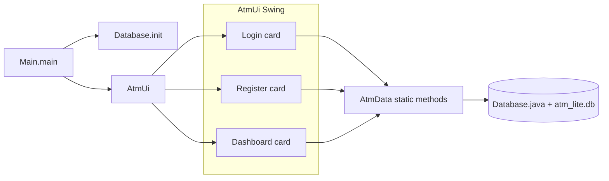

# ATM Lite — project structure and how it works

ATM Lite is a small **desktop** practice application: **Java Swing** for the interface and **SQLite** (via JDBC) to save users, balances, and a simple transaction log. It is intentionally minimal so students and teachers can read the whole flow in a few files.

---

## Folder structure

```text
atm-lite/
├── atm-lite.iml              ← IntelliJ module file (classpath to the JARs)
├── sqlite-jdbc-*.jar         ← SQLite JDBC driver (required at runtime)
├── slf4j-api-*.jar           ← Logging API used by the SQLite driver
├── slf4j-simple-*.jar        ← Simple logging implementation
├── PROJECT.md                ← this document
└── src/
    ├── Main.java             ← starts the program
    ├── Database.java         ← SQLite connection + table creation
    ├── AtmData.java          ← SQL + rules (register, login, money, PIN)
    └── AtmUi.java            ← one window: login, register, dashboard
```

When you run the app, SQLite creates a file **`atm_lite.db`** in the **current working directory** (often the project folder or the folder from which you start `java`). That file holds all persisted data.

---

## How the program works (big picture)

1. **`Main.main`** is the entry point. It schedules work on the **Swing event thread (EDT)** because Swing windows must be created and updated on that thread.
2. **`Database.init()`** runs once at startup. It opens SQLite and runs `CREATE TABLE IF NOT EXISTS` so the `users` and `logs` tables exist.
3. **`AtmUi`** builds **one** `JFrame` and puts three “screens” inside it using **`CardLayout`**: *login*, *register*, and *dashboard*. Only one card is visible at a time; methods like `showLogin()` switch which card is shown.
4. The UI does **not** talk to JDBC directly for every feature. Instead it calls **`AtmData`** static methods (`login`, `register`, `deposit`, …). **`AtmData`** opens a connection through **`Database.connect()`**, runs SQL, and returns simple results (`boolean`, `User`, or `null`).
5. After **login**, an **`AtmData.User`** object is stored in the field **`session`**. That object holds `id`, `username`, `pin`, and `balance` in memory. After **deposit** / **withdraw** / **change PIN**, the UI calls **`AtmData.reload(session.id)`** to read the latest balance from the database and refresh labels.



---

## What each file does

### `src/Main.java`

- Contains **`public static void main(String[] args)`**, which is where the JVM starts.
- Uses **`SwingUtilities.invokeLater(...)`** so the window is created on the EDT (correct Swing practice).
- Calls **`Database.init()`** before **`new AtmUi()`** so tables always exist before any screen uses them.

### `src/Database.java`

- **Single responsibility:** connect to SQLite and ensure the schema exists.
- **`connect()`** returns a JDBC **`Connection`** to `jdbc:sqlite:atm_lite.db`.
- **`init()`** creates:
  - **`users`**: one row per account (`username`, `password`, `pin`, `balance`, …).
  - **`logs`**: optional history rows (`user_id`, `action`, `amount`, `time`).
- This class does **not** implement login rules or money logic; it only prepares the database.

### `src/AtmData.java`

- **Single place for “what is allowed” + SQL.**
- Defines a small in-memory type **`AtmData.User`** (nested class) used after login.
- **`pinOk(String)`** enforces a **4-digit numeric PIN** (educational simplicity).
- **Account lifecycle**
  - **`register(...)`** inserts a new user; returns `false` if the username already exists (unique constraint) or another error occurs.
  - **`login(...)`** checks username and password in SQL; returns a **`User`** or **`null`**.
  - **`reload(userId)`** reads the latest row from `users` (used to refresh balance on the dashboard).
- **Money and PIN**
  - **`deposit`** / **`withdraw`** update `balance` only when the **PIN in SQL matches** the typed PIN (wrong PIN means zero rows updated → failure).
  - **`withdraw`** also requires enough balance (enforced in the `UPDATE` condition).
  - **`changePin`** updates the stored PIN (demo: no “old PIN” step).
- **`insertLog` (private)** writes a row to **`logs`** for deposits, withdrawals, and PIN changes so you can explain “audit trail” in class.

### `src/AtmUi.java`

- One **`JFrame`** subclass: the entire application window.
- **`CardLayout`** on **`root`** switches between:
  - **Login:** username + password; **Enter** in the fields triggers the same action as **Login**; the root pane **default button** is **Login** while this card is visible.
  - **Register:** username, password, PIN, confirm PIN; **Enter** in any field triggers **Create account**; default button is **Create account** on this card; **Back** returns to login.
  - **Dashboard:** welcome + balance; deposit/withdraw with amount + PIN; change PIN with two fields; **Logout** clears the session and returns to login.
- Calls **`AtmData`** for all persistence; shows messages in labels or small dialogs (`JOptionPane` after successful registration).
- Uses **`readAmount(...)`** to parse money input safely (invalid input → a friendly message instead of crashing).

---

## Database tables (short reference)

| Table   | Purpose |
|---------|---------|
| `users` | Stores accounts: username (unique), password, PIN, balance. |
| `logs`  | Stores a simple history of actions linked to `user_id`. |

> **Teaching note:** passwords and PINs are stored **in plain text** on purpose for readability. A real system would use hashing and much stronger security; say that explicitly when presenting.

---

## Dependencies (JARs)

The SQLite driver needs these on the **classpath** at compile time and runtime (already referenced in `atm-lite.iml` for IntelliJ):

- `sqlite-jdbc-*.jar`
- `slf4j-api-*.jar`
- `slf4j-simple-*.jar`

---

## How to run

**IntelliJ:** open the `atm-lite` folder as a module and run **`Main`**.

**Command line (Windows, from `atm-lite`):**

```powershell
javac -encoding UTF-8 --release 17 -cp "sqlite-jdbc-3.45.1.0.jar;slf4j-api-2.0.12.jar;slf4j-simple-2.0.12.jar" -d out src\Main.java src\Database.java src\AtmData.java src\AtmUi.java
java -cp "out;sqlite-jdbc-3.45.1.0.jar;slf4j-api-2.0.12.jar;slf4j-simple-2.0.12.jar" Main
```

Adjust JAR file names if your copies use different version numbers.

---

## Suggested explanation order for a class demo

1. **`Main`** → why the EDT matters.  
2. **`Database.init`** → tables and the `.db` file.  
3. **`AtmData.login` / `register`** → SQL as the source of truth.  
4. **`AtmUi` + `CardLayout`** → one window, many views.  
5. **`deposit` / `withdraw`** → PIN check + `logs` for traceability.
